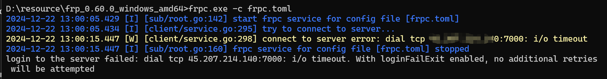

# 服务器

## 0.服务器防火墙开放端口和安全组

```shell
sudo firewall-cmd --state # 查看防火墙状态

sudo systemctl stop firewalld.service #关闭防火墙

sudo systemctl start firewalld.service #开启防火墙

sudo firewall-cmd --zone=public --add-port=7000/tcp --permanent # 开放7000端口
sudo firewall-cmd --zone=public --add-port=24642/udp --permanent # 开放24642端口
sudo firewall-cmd --reload # 配置立即生效
```

## 1.创建目录方便管理

```bash
mkdir 星露谷
cd 星露谷
```

## 2. **安装 `wget`（如果未安装）**

如果系统中缺少 `wget`，可以使用 `yum` 来安装：

```bash
sudo yum install wget -y
```

## 3.下载内网穿透工具

- 下载

```shell
wget https://github.com/fatedier/frp/releases/download/v0.60.0/frp_0.60.0_linux_amd64.tar.gz
```

> 如果下载很慢直接去github下载然后上传到服务器

[Releases · fatedier/frp](https://github.com/fatedier/frp/releases)

- 解压

```shell
tar -zxvf frp_0.60.0_linux_amd64.tar.gz
```

### 修改配置文件（修改启动端口）

>默认7000

```
vi frps.toml
```

> 服务器需要开放7000和24642端口

## 启动

```shell
cd frp_0.60.0_linux_amd64 #进入到对应目录
```

- `nohup` 后台运行。
- 输出日志会保存到 `frps.log` 文件中。

```shell
nohup ./frps -c frps.toml > frps.log 2>&1 &
```

### 停止服务

```
netstat -lnpt |grep 7000
```


```sh
sudo kill -9 18985 # 立即杀死进程，不会给它任何机会进行清理

sudo kill -15 18985 # 优雅地终止进程 允许进程进行清理操作
```


# 服主电脑

## 1.下载内网穿透工具

[Releases · fatedier/frp](https://github.com/fatedier/frp/releases)

- 下载符合自己的


## 2.修改配置文件

- 修改`frpc.toml`

```
serverAddr = "你的服务器ip"
serverPort = 7000

[[proxies]]
name = "这个随便"
type = "udp"
localIP = "127.0.0.1"
localPort = 24642
remotePort = 24642
```


## 3.启动内网穿透工具

- 当前目录下在`cmd`启动工具

```cmd
frpc.exe -c frpc.toml
```


- 注意事项

>游玩过程中不要关cmd窗口

## 4.开服联机

### 服主


### 玩家


- 输入服务器ip:24642加入游戏


- 这里是不同的存档


## 连接失败




- 解决办法

检查服务器防火墙和安全组是否开启对应对应端口

```shell
sudo firewall-cmd --zone=public --add-port=7000/tcp --permanent # 开放7000端口
sudo firewall-cmd --zone=public --add-port=24642/udp --permanent # 开放24642端口
sudo firewall-cmd --reload # 配置立即生效
```

​	
